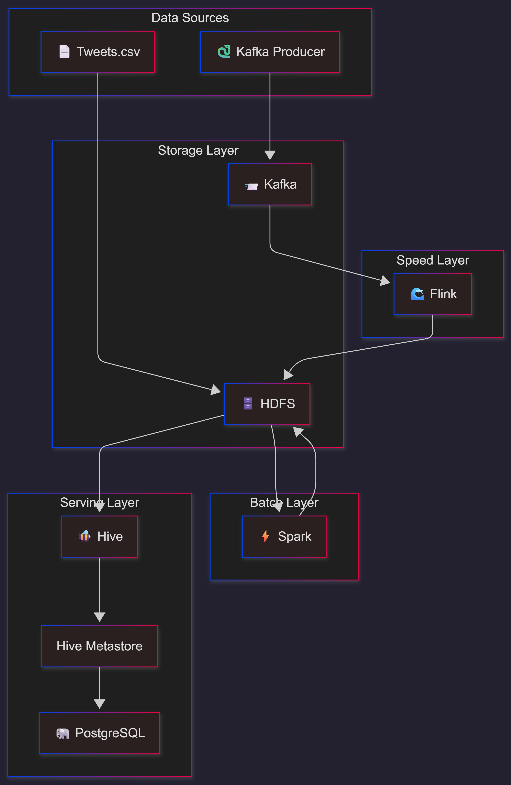

# 🐦 Twitter Sentiment Analysis - Lambda Architecture

[](https://hadoop.apache.org/)
[](https://spark.apache.org/)
[](https://flink.apache.org/)
[](https://kafka.apache.org/)
[](https://hive.apache.org/)

A production-ready **Lambda Architecture** implementation for real-time and batch analysis of Twitter airline sentiment data.

---

## 📋 Table of Contents

- [Overview](#overview)
- [Architecture](#architecture)
- [Project Structure](#project-structure)
- [Prerequisites](#prerequisites)
- [Quick Start](#quick-start)
- [Testing Guide](#testing-guide)
  - [Part 1: Batch Processing (Spark)](#part-1-batch-processing-spark)
  - [Part 2: Stream Processing (Kafka + Flink)](#part-2-stream-processing-kafka--flink)
- [Web UIs](#web-uis)
- [Configuration Reference](#configuration-reference)
- [Troubleshooting](#troubleshooting)
- [Design Decisions](#design-decisions)

---

## Overview

This project implements a **Lambda Architecture** to analyze Twitter sentiment data about airlines. The architecture combines:

- **Batch Layer**: Historical analysis using Apache Spark
- **Speed Layer**: Real-time streaming using Apache Kafka + Flink
- **Serving Layer**: Unified access via Apache Hive tables

### Key Features

| Feature | Implementation |
|---------|---------------|
| Batch Processing | Spark reads CSV → Aggregates by airline → Writes Parquet |
| Stream Processing | Kafka ingestion → Flink processing → HDFS (Avro) + Real-time alerts |
| Storage | HDFS (distributed file system) |
| Metadata | Hive Metastore (PostgreSQL backend) |
| Self-Initializing | Containers automatically set up on first run |

---

## Architecture



### Data Flow

| Layer | Input | Processing | Output |
|-------|-------|------------|--------|
| **Batch** | `/project/raw/Tweets.csv` | Spark aggregation | `/project/batch_results_parquet/` |
| **Speed** | `tweets_topic` (Kafka) | Flink streaming | `/project/streamed_tweets_avro/` + Console alerts |

---

## Project Structure

```
HPDP Project/
├── conf/                          # Configuration files
│   ├── core-site.xml              # Hadoop core config
│   ├── hdfs-site.xml              # HDFS config
│   └── hive-site.xml              # Hive config
├── data/                          # Source data
│   └── Tweets.csv                 # Twitter sentiment dataset
├── docker/                        # Custom Docker images
│   ├── flink/                     # Flink with Python + connectors
│   ├── hive/                      # Hive 4.0.0 with PostgreSQL driver
│   └── spark/                     # Spark 4.1.0 with Hive support
├── scripts/
│   ├── init/                      # Initialization scripts
│   │   ├── start_namenode.sh      # HDFS setup + data upload
│   │   └── start_hiveserver2.sh   # HiveServer2 + table creation
│   ├── jobs/                      # Processing jobs
│   │   ├── batch_job.py           # Spark batch analysis
│   │   ├── stream_job.py          # Flink streaming job
│   │   └── producer.py            # Kafka tweet producer
│   └── sql/                       # SQL definitions
│       └── hive_tables.sql        # Hive table DDLs
└── docker-compose.yml             # Orchestration
```

---

## Prerequisites

| Requirement | Minimum |
|-------------|---------|
| Docker | 20.10+ |
| Docker Compose | 2.0+ |
| RAM | 8 GB |
| Disk | 10 GB |

> [!IMPORTANT]
> **Platform Note**: This project was developed on **Windows**. If you're running on **Linux**, you may need to modify escape characters in `docker-compose.yml`. See the [Platform Compatibility](#platform-compatibility-windowslinux) section in Troubleshooting.

### Required Ports

| Port | Service |
|------|---------|
| 8080 | Spark Master UI |
| 8081 | Flink Dashboard |
| 9000 | HDFS NameNode RPC |
| 9083 | Hive Metastore |
| 9092 | Kafka Broker |
| 9870 | HDFS NameNode UI |
| 10000 | HiveServer2 |

---

## Quick Start

```bash
# 1. Clone the repository
git clone https://github.com/0xmillennium/HPDP-Project.git
cd HPDP-Project

# 2. Start all services
docker-compose up -d

# 3. Wait for initialization (~2-3 minutes)
docker-compose logs -f namenode hiveserver2

# 4. Verify all services are healthy
docker-compose ps
```

All containers will self-initialize:
- **NameNode**: Creates HDFS directories, uploads `Tweets.csv`
- **HiveServer2**: Creates all Hive tables from SQL file

---

## Testing Guide

### Part 1: Batch Processing (Spark)

#### Step 1: Verify HDFS Data

```bash
# Check that Tweets.csv is uploaded
docker exec hpdpproject-namenode-1 hdfs dfs -ls /project/raw/
```

**Expected output:**
```
-rw-r--r--   1 hadoop supergroup    3421431 2025-12-24 01:23 /project/raw/Tweets.csv
```

#### Step 2: Run Batch Job

```bash
docker exec hpdpproject-spark-master-1 \
  /opt/spark/bin/spark-submit \
  --master spark://spark-master:7077 \
  --driver-java-options "-Duser.home=/tmp" \
  /jobs/batch_job.py
```

**Expected output:**
```
Spark Session Created. Reading from Hive...
Aggregation Complete. Sample results:
+--------+------------+--------------+--------------+-------------+--------------+
| airline|total_tweets|positive_count|negative_count|neutral_count|negative_ratio|
+--------+------------+--------------+--------------+-------------+--------------+
|  United|        3822|           492|          2633|          697|          0.69|
|American|        2759|           336|          1960|          463|          0.71|
...
Batch Job Successfully Completed.
```

#### Step 3: Verify Results in Hive

```bash
docker exec hpdpproject-hiveserver2-1 \
  beeline -u "jdbc:hive2://localhost:10000/default" -n hive \
  -e "SELECT * FROM batch_airline_sentiment;"
```

**Expected output:**
| airline | total_tweets | positive | negative | neutral | negative_ratio |
|---------|-------------|----------|----------|---------|----------------|
| US Airways | 2,913 | 269 | 2,263 | 381 | 0.78 |
| American | 2,759 | 336 | 1,960 | 463 | 0.71 |
| United | 3,822 | 492 | 2,633 | 697 | 0.69 |
| Southwest | 2,420 | 570 | 1,186 | 664 | 0.49 |
| Delta | 2,222 | 544 | 955 | 723 | 0.43 |
| Virgin America | 504 | 152 | 181 | 171 | 0.36 |

---

### Part 2: Stream Processing (Kafka + Flink)

#### Step 1: Create Kafka Topic

```bash
docker exec hpdpproject-kafka-1 \
  /opt/kafka/bin/kafka-topics.sh \
  --create --topic tweets_topic \
  --bootstrap-server localhost:9092 \
  --partitions 1 --replication-factor 1 \
  --if-not-exists
```

#### Step 2: Submit Flink Job (Background)

```bash
docker exec -d hpdpproject-flink-jobmanager-1 \
  flink run -py /jobs/stream_job.py
```

Verify job is running at: http://localhost:8081

#### Step 3: Install Kafka Library & Run Producer

```bash
# Install kafka-python
docker exec hpdpproject-client-1 pip install kafka-python -q

# Start producer (sends tweets to Kafka)
docker exec hpdpproject-client-1 python /jobs/producer.py
```

#### Step 4: View Real-Time Alerts

```bash
docker logs -f hpdpproject-flink-taskmanager-1
```

**Expected output:**
```
+I[ALERT [United]: @united YOU GUYS ARE HORRIBLE.]
+I[ALERT [American]: @AmericanAir worst customer service ever!]
+I[ALERT [Delta]: @delta delayed AGAIN...]
```

#### Step 5: Stop Stream Processing

```bash
# Stop producer
docker exec hpdpproject-client-1 pkill -f producer.py

# Cancel Flink job via UI: http://localhost:8081
# Or restart containers:
docker-compose restart flink-jobmanager flink-taskmanager
```

---

## Web UIs

| Service | URL | Purpose |
|---------|-----|---------|
| HDFS NameNode | http://localhost:9870 | Browse HDFS files |
| Spark Master | http://localhost:8080 | Cluster status, completed apps |
| Flink Dashboard | http://localhost:8081 | Running/completed jobs |

---

## Configuration Reference

### Volume Mounts (File-Level)

Each container mounts only the specific files it needs:

| Container | Mounted Files |
|-----------|---------------|
| `namenode` | `start_namenode.sh`, `Tweets.csv` |
| `hiveserver2` | `start_hiveserver2.sh`, `hive_tables.sql` |
| `spark-master` | `batch_job.py` |
| `flink-jobmanager` | `stream_job.py` |
| `client` | `producer.py`, `Tweets.csv` |

### Healthcheck Strategy

All services use application-aware healthchecks:

| Service | Healthcheck |
|---------|-------------|
| NameNode | Safe mode OFF |
| DataNode | JMX endpoint |
| Hive Metastore | TCP port 9083 |
| HiveServer2 | `beeline` connection |
| Kafka | Broker API versions |
| Flink | REST API |
| Spark | Web UI |

---

## Troubleshooting

### Services not starting

```bash
# Check service status
docker-compose ps

# View logs for specific service
docker logs hpdpproject-namenode-1
docker logs hpdpproject-hiveserver2-1
```

### HDFS data missing

```bash
# Restart namenode to re-initialize
docker-compose restart namenode

# Or full reset
docker-compose down && docker-compose up -d
```

### Hive tables not found

```bash
# Check HiveServer2 logs for initialization
docker logs hpdpproject-hiveserver2-1 | grep -E "(Creating|Complete)"
```

### Flink job fails with "topic not found"

```bash
# Create topic first
docker exec hpdpproject-kafka-1 \
  /opt/kafka/bin/kafka-topics.sh \
  --create --topic tweets_topic \
  --bootstrap-server localhost:9092 \
  --partitions 1 --replication-factor 1
```

### Platform Compatibility (Windows/Linux)

This project was developed on **Windows**, which uses different escape character handling than Linux in Docker Compose files.

**If you encounter errors like:**
```
ERROR: Invalid interpolation format for "command" option...
```

**Apply these fixes to `docker-compose.yml`:**

| Line | Service | Windows (Original) | Linux (Fixed) |
|------|---------|-------------------|---------------|
| 6 | namenode | `'\r$/'` | `'\r$$/'` |
| 77 | hiveserver2 | `'\\r$/'` | `'\r$$/'` |
| 112 | kafka | `$(/opt/kafka/...)` | `$$(/opt/kafka/...)` |

**Explanation:**
- Docker Compose interprets `$` as variable interpolation
- On Linux, use `$$` to escape the literal `$` character
- On Windows, the shell handles escaping differently

**Quick fix commands for Linux:**
```bash
# Fix namenode command (line 6)
sed -i "s/'\\\\r\$\/'/'\
\$\$\/'/" docker-compose.yml

# Fix kafka command - escape $() subshell
sed -i 's/\$(\//\$\$(\//g' docker-compose.yml
```

Alternatively, manually edit `docker-compose.yml` and change:
- `$` → `$$` in shell commands where you want a literal dollar sign

---

## Design Decisions

#### Why HDFS (Hadoop Distributed File System)?

**Problem**: Need to store large volumes of data reliably across multiple machines.

**Solution**: HDFS provides:
- **Fault tolerance**: Data is replicated across nodes (default 3x)
- **Scalability**: Can grow from GBs to PBs by adding nodes
- **High throughput**: Optimized for batch processing, not random access
- **Integration**: Native support from Spark, Flink, Hive

**In our project**: Stores raw tweets, batch results (Parquet), and streamed data (Avro).

---

#### Why Apache Hive?

**Problem**: Analysts need SQL access to data stored in HDFS without writing MapReduce/Spark code.

**Solution**: Hive provides:
- **SQL interface**: Query HDFS data using familiar SQL syntax
- **Schema management**: Central metastore tracks table schemas and locations
- **Unified access**: Both batch (Spark) and stream (Flink) results queryable from one place
- **Format abstraction**: Hides complexity of Parquet, Avro, CSV formats

**In our project**: Acts as the **Serving Layer** - unified view of batch and streaming results.

---

#### Why Apache Spark (Batch Layer)?

**Problem**: Need to process entire historical dataset for aggregations and analytics.

**Solution**: Spark provides:
- **In-memory processing**: 10-100x faster than Hadoop MapReduce
- **Hive integration**: Reads/writes Hive tables seamlessly via Metastore
- **Rich API**: DataFrame/SQL operations for complex transformations
- **Fault tolerance**: Automatic recovery from node failures

**In our project**: Reads all tweets → Aggregates sentiment by airline → Writes to Hive table.

---

#### Why Apache Flink (Speed Layer)?

**Problem**: Need real-time processing with low latency for immediate insights.

**Solution**: Flink provides:
- **True streaming**: Event-at-a-time processing (not micro-batches like Spark Streaming)
- **Exactly-once semantics**: Guarantees no duplicate processing
- **Stateful processing**: Can maintain aggregations across events
- **Kafka connector**: Native integration with Kafka for ingestion

**In our project**: Consumes tweets in real-time → Filters negative sentiment → Writes to HDFS + alerts.

---

#### Why Apache Kafka?

**Problem**: Need to decouple data producers from consumers with reliable message delivery.

**Solution**: Kafka provides:
- **Decoupling**: Producers and consumers operate independently
- **Durability**: Messages persisted to disk, survives restarts
- **Replay**: Consumers can re-read past messages
- **Scalability**: Handles millions of messages per second

**In our project**: Buffers incoming tweets so Flink can process at its own pace.

---

#### Why PostgreSQL for Hive Metastore?

**Problem**: Hive's default Derby database doesn't support concurrent connections.

**Solution**: PostgreSQL provides:
- **Concurrency**: Multiple clients can query metadata simultaneously
- **Durability**: ACID transactions protect metadata integrity
- **Production-ready**: Enterprise-grade reliability

**In our project**: Stores table schemas, partition info, and HDFS locations for all Hive tables.